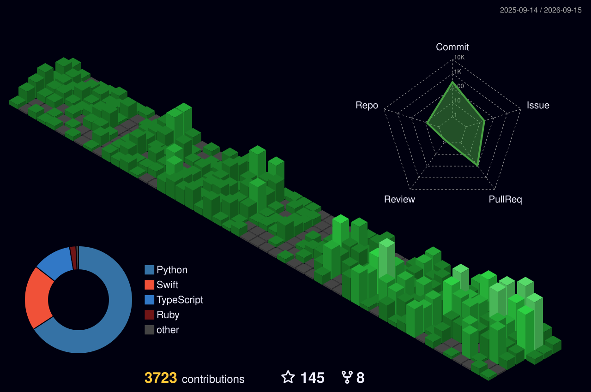

# Hi, I'm Yasser Shkeir 👋

**Senior Backend & Platform Engineer** · Python / Django · Distributed Systems · Open-Source Maintainer

---

### About

I build and operate production Django systems, and I maintain open-source libraries for the
unglamorous part of that job — keeping things up under load and not breaking them on deploy.

Day to day I'm the technical owner of a three-service platform at **GreenTomatoMedia** serving
10+ consumer mobile apps in 25+ languages: API design, Celery/Redis pipelines, database
performance, production LLM integration, and the release process around all of it. Recent work
has been mostly AI and automation — a multi-provider LLM service behind a live consumer product,
AI-assisted localization, and App Store release automation.

Based in Chiang Mai 🇹🇭 (UTC+7), working remote.

---

### 📦 Open Source

**[django-smart-ratelimit](https://github.com/YasserShkeir/django-smart-ratelimit)** — High-performance
distributed rate limiting for Django. Four algorithms (token bucket, sliding window, fixed window,
leaky bucket) as atomic Redis Lua operations, sync + async decorators, circuit breaker and
automatic failover, shadow mode for zero-risk rollout, pluggable backends, Prometheus +
OpenTelemetry observability, runtime-editable rules, DRF throttles and GraphQL middleware.
Django 3.2–6.0.

**[django-safe-migrations](https://github.com/YasserShkeir/django-safe-migrations)** — Static analysis
that catches unsafe migrations before they reach production. 36 rules across 14 categories
(table locks, data loss, SQL injection, schema/state mismatch), PostgreSQL-aware, with GitHub
Actions / GitLab Code Quality / SARIF output, baseline suppression, and git-diff mode for CI.

**[torpor](https://github.com/YasserShkeir/torpor)** — macOS menu-bar app for Claude Code sessions.
Shows what each session actually costs in memory (including the MCP child processes Activity
Monitor misattributes) and hibernates the idle ones without losing them. Swift, `brew install`.

**[sluice](https://github.com/YasserShkeir/sluice)** — Local-only interceptor and explorer for your
own SaaS API traffic. Capture, normalise and replay what the apps you already use are actually
calling — MITM proxy, token extraction, or passive CDP capture. CLI, web dashboard, MCP server.

---

### 🧪 Building

- **[Atlagene](https://atlagene.com)** — genomics health platform: raw DNA analysis across 21 health
  categories with a genome-grounded AI assistant. Django, Next.js, AWS ECS Fargate, Terraform.
- **OrderScribe** — ordering and operations platform for restaurants, live in production.
- **[houya.co](https://houya.co)** — systems & development agency: backend architecture, data
  pipelines, AI integrations.

---

### 🛠️ Tech

**Backend** — Python · Django · Django REST Framework · FastAPI · Celery · Redis · REST / GraphQL / WebSockets  
**Data** — PostgreSQL · MySQL · MongoDB · Redis · schema design · query optimization · zero-downtime migrations  
**Infra** — AWS (EC2, ECS Fargate, S3, RDS, Bedrock) · Terraform · Docker · Nginx · Gunicorn · GitHub Actions · Prometheus · OpenTelemetry  
**AI / LLM** — Multi-provider orchestration (OpenAI, Anthropic, Bedrock) · retrieval & memory systems · tool use · model routing & cost control  
**Frontend** — React · Next.js · TypeScript · React Native · Tailwind CSS

---

### 📊 Activity

  

