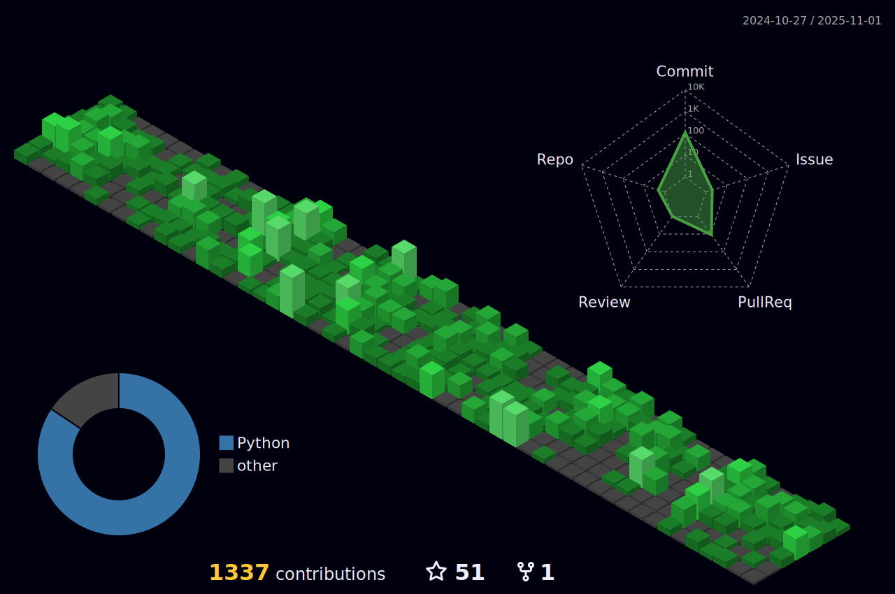

<h1 align="left">Hi, I'm Yasser Shkeir </h1>
<h3 align="left">
  💪 A passionate Fullstack developer from Lebanon
  
</h3>

 

<h3 align="left">🤔 What am I doing these days?</h3>
<ul align="left">
  <li>💻 teaching coding to students worldwide.</li>
  <li>🧠 learning TypeScript and LAMP stack.</li>
  <li>👨‍💻 improving my time management skills.</li>
  <li>🌅 sticking to a healthy sleep schedule.</li>
  <li>🪴 taking care of my lovely plants.</li>
</ul>

  

<h3 align="left">Connect with me:</h3>

| Portfolio | LinkedIn | Hackerrank | Leetcode |
| :-: | :-: | :-: | :-: |
|  |  |  |  |

<h3 align="left">Languages and Tools:</h3>

  

    <h4>Prog:</h4>
     
     
     
     
     
     
     
     
     
    
     
     
     
     
     
     
     
  

  

    <h4>Misc:</h4>
     
     
     
     
    
     
     
     
  

   

<h4>Activity Chart for the past year:</h4>

  

